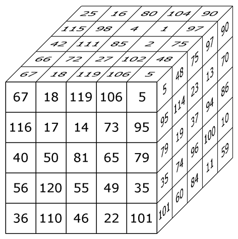

# Tugas Besar Dasar AI

Implementasi beberapa algoritma local search (Varian Hill Climbing, Simulated Annealing, dan Genetic Algorithm) & performance measuring dari algoritma tersebut untuk permasalahan diagonal magic cube 5x5x5

<p align="center">
    <br>
    Gambar Diagonal Magic Cube 5x5x5 <br>
    (Sumber: <a href="https://www.trump.de/magic-squares/magic-cubes/cubes-1.html">https://www.trump.de/magic-squares/magic-cubes/cubes-1.html</a>)
</p>

## Notes

Build and tested in Ubuntu 20.04 via Docker from Arch Linux

| Nama                         | NIM      |
| ---------------------------- | -------- |
| Anthony Bryant Gouw          | 18222033 |
| Christopher Richard Chandra  | 18222057 |
| Richie Leonardo              | 18222071 |
| Josia Ryan Juliandy Silalahi | 18222075 |

## Proses Instalasi Pada Windows

- Install [Docker Desktop](https://www.docker.com/products/docker-desktop/) ataupun [Docker CLI](https://docs.docker.com/get-started/get-docker/)
- Download Dockerfile yang sudah disediakan
- Install dan jalankan [X Server](https://sourceforge.net/projects/vcxsrv/)
- Build images Docker yang sudah diinstall dengan menjalankan command pada direktori Dockerfile berada

```
docker build -t ubuntu22 .
```

- Buat docker container

```
docker run -it --hostname docker --gpus all  --name Ubuntu22 ubuntu22 /bin/bash
```

- Test GUI dengan menjalankan xeyes

```
xeyes
```

## How to Run

Make sure CMake installed

```bash
sudo apt install cmake

```

Open build folder

```bash
cd build
```

Clean existing build

```bash
rm -rf *
```

Run CMake

```bash
cmake ..
```

Build the program

```bash
make
```

Run program

```bash
./cube
```

